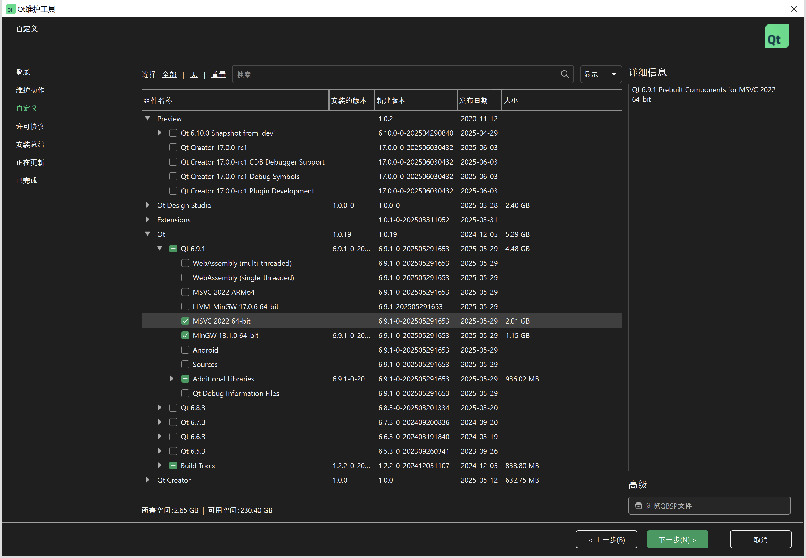
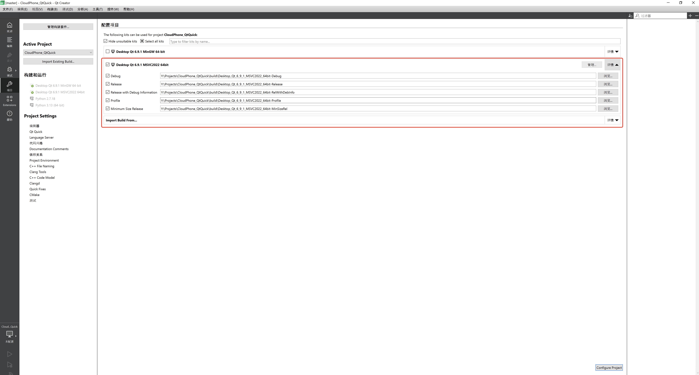
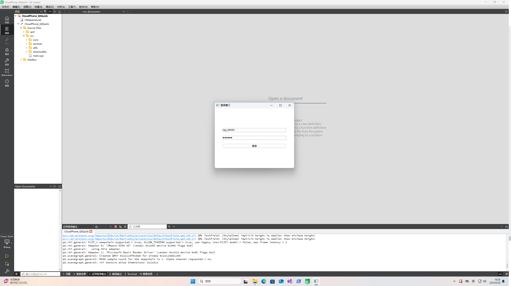
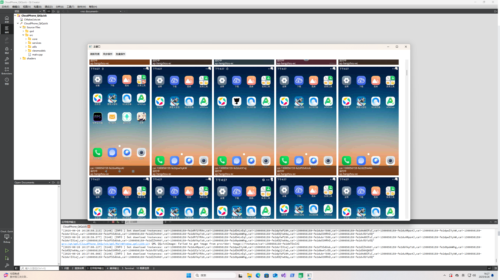
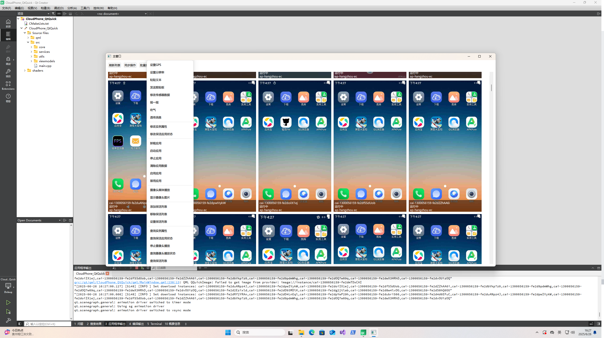
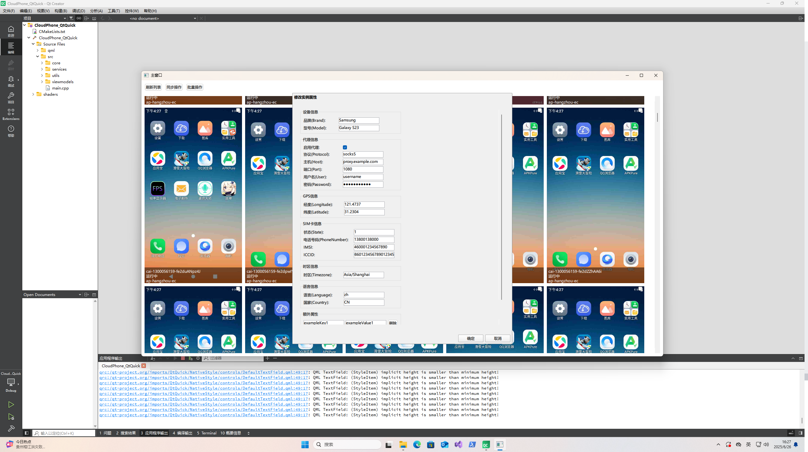
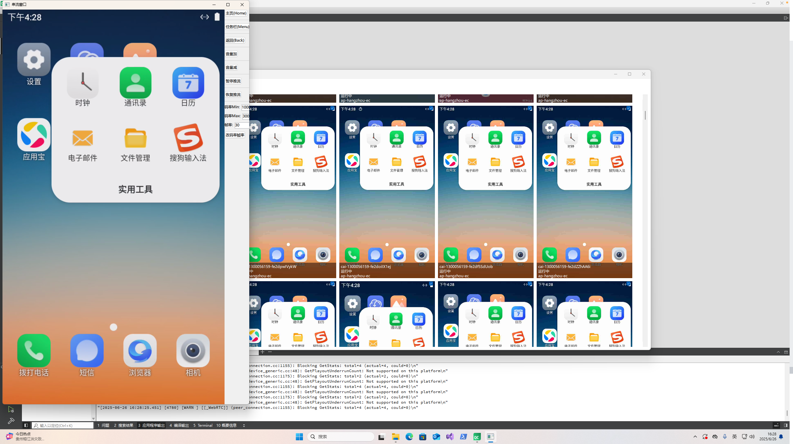

# Cloud Phone QtQuick Demo 快速上手指南

基于 Qt Quick 的云手机TcrSdk客户端演示工程

## 项目简介

CloudPhone_QtQuick 是一个基于 Qt 6/QML 的云手机管理与串流客户端演示工程，集成了 [TcrSdk](https://cg-sdk-1258344699.cos.ap-nanjing.myqcloud.com/CloudDeviceWinSDK/docs/release_note.html) 云手机 SDK，支持多实例管理、批量操作、视频流渲染、触摸/按键控制等功能。适用于 Windows 平台，便于企业或开发者参考如何批量管理和远程控制云手机实例。

## 主要特性

- **实例管理**：卡片式展示所有云手机实例，支持多选、批量操作。
- **视频串流**：支持单实例和多实例同步视频流渲染与交互。
- **批量操作**：支持分辨率、GPS、剪贴板、应用管理、传感器、摄像头等多种批量操作。
- **自定义渲染**：基于 OpenGL Shader 的 YUV 视频渲染。
- **高性能图片加载**：实例卡片图片异步加载，滚动时自动暂停/恢复下载。

## 目录结构

```
.
├── CMakeLists.txt                # CMake 构建脚本
├── docs/                         # 文档图片
│   └── images/
├── qml/                          # QML 界面文件
│   ├── LoginWindow.qml           # 登录界面
│   ├── MainWindow.qml            # 主界面（实例卡片展示）
│   ├── StreamingWindow.qml       # 视频流播放窗口
│   └── components/               # QML 复用组件
│       └── Dialogs.qml           # 批量操作对话框组件
├── README.md                     # 项目说明文档
├── shaders/                      # OpenGL 着色器
│   ├── yuv.frag                  # YUV片段着色器
│   └── yuv.vert                  # YUV顶点着色器
├── src/                          # C++ 源码
│   ├── main.cpp                  # 程序入口
│   ├── core/                     # 业务核心与渲染
│   │   ├── BatchTaskOperator.cpp # 批量任务操作实现
│   │   ├── BatchTaskOperator.h   # 批量任务操作接口
│   │   └── video/                # 视频渲染相关
│   │       ├── Frame.h           # 视频帧数据结构
│   │       ├── VideoRenderItem.cpp # 视频渲染项实现
│   │       ├── VideoRenderItem.h # QQuickItem视频渲染组件
│   │       ├── YuvMaterial.cpp   # YUV材质实现
│   │       ├── YuvMaterial.h     # OpenGL YUV着色材质
│   │       ├── YuvNode.cpp       # 场景图YUV节点实现
│   │       ├── YuvNode.h         # 场景图YUV渲染节点
│   │       ├── YuvTestPattern.cpp # YUV测试模式生成器
│   │       └── YuvTestPattern.h  # YUV测试模式工具
│   ├── services/                 # 网络与API服务
│   │   ├── ApiService.cpp        # 云手机API服务实现
│   │   ├── ApiService.h          # 云手机API服务接口(演示云API的调用)
│   │   ├── NetworkService.cpp    # 网络请求服务实现
│   │   └── NetworkService.h      # 网络请求服务接口
│   ├── utils/                    # 工具类
│   │   ├── InstanceImageDownloader.cpp # 实例图片下载器
│   │   ├── InstanceImageDownloader.h   # 异步图片下载管理
│   │   ├── InstanceImageProvider.cpp   # QML图片提供器
│   │   ├── InstanceImageProvider.h     # 实例图片缓存管理
│   │   ├── Logger.cpp            # 日志记录器实现
│   │   ├── Logger.h              # 日志系统接口
│   │   ├── VariantListConverter.cpp # QVariant列表转换器
│   │   └── VariantListConverter.h # 数据类型转换工具
│   └── viewmodels/               # QML 绑定的 ViewModel
│       ├── AndroidInstanceModel.cpp # 云手机实例数据模型
│       ├── AndroidInstanceModel.h # 实例列表数据管理
│       ├── BatchTaskOperatorModel.cpp # 批量操作模型
│       ├── BatchTaskOperatorModel.h # 批量任务UI绑定
│       ├── LoginViewModel.cpp     # 登录业务逻辑
│       ├── LoginViewModel.h       # 登录认证管理
│       ├── StreamingViewModel.cpp # 视频流控制逻辑
│       └── StreamingViewModel.h   # 视频流交互管理
└── third_party/
    └── TcrSdk/                   # 云手机SDK（含头文件、lib、dll）
        ├── Debug/                # Debug版本SDK
        │   ├── include/
        │   ├── Win32/
        │   └── x64/
        └── Release/              # Release版本SDK
            ├── include/
            ├── Win32/
            └── x64/

```

## 依赖环境

- **编译器** 需使用`MSVC 2022 64-bit`进行编译
- **Qt 6.8+** (需包含 Quick、Network、Concurrent、ShaderTools 模块)
- **CMake 3.16+**
- **TcrSdk** 云手机 SDK（从[发布说明](docs/Release_Note.md)下载到 `third_party/TcrSdk` 目录）

## 构建方法

### 1. 安装 Visual Studio（MSVC 编译器）

- 如果尚未安装，请前往 [Visual Studio 2022 官方下载页面](https://visualstudio.microsoft.com/zh-hans/downloads/)下载安装包。
- 安装过程中**务必勾选“使用C++的桌面开发”**，以确保 MSVC 编译器和相关工具链被正确安装。

---

### 2. 安装 Qt 6 的 MSVC 版本

- 启动 **Qt Maintenance Tool** 或 **Qt Online Installer**。
- 选择“添加或删除组件”。
- 在“Qt 6.x.x”下，找到与你的 Visual Studio 版本对应的 MSVC 组件，例如：
  - `MSVC 2022 64-bit`
- 勾选所需的 MSVC 版本，点击“下一步”完成安装。
- 

---

### 3. 在 Qt Creator 里选择 MSVC Kit

- 安装完成后，重启 **Qt Creator**。
- 打开“工具”→“选项”→“Kits”（或“构建套件”）。
- 在“自动检测”区域应能看到类似 `Desktop Qt 6.x.x MSVC 2022 64-bit` 的 Kit。
- 新建项目或打开本项目时，选择对应的 MSVC Kit 进行构建。
- 

---

### 4. 使用 Qt Creator 打开并编译项目

1. 启动 **Qt Creator**，点击“打开项目”，选择本项目根目录下的 `CMakeLists.txt` 文件。
2. 在弹出的“配置项目”界面，选择你已安装的 MSVC Kit（如 `Desktop Qt 6.x.x MSVC 2022 64-bit`）。
3. 点击“配置项目”并等待 Qt Creator 完成 CMake 配置。
4. 在左侧“项目”面板中，点击“构建”按钮（或按 `Ctrl+B`）进行编译。
5. 编译完成后，可直接点击“运行”按钮（或按 `Ctrl+R`）启动程序。

> **注意：**  
> - 运行前请确保构建的套件是`MSVC 2022 64-bit`

---

## 运行截图

- 
- 
- 
- 
- 

## 主要模块说明

- **src/main.cpp**  
  应用入口，初始化服务、ViewModel、QML 上下文等。

- **src/viewmodels/**  
  - `LoginViewModel`：登录逻辑
  - `AndroidInstanceModel`：实例列表与图片管理
  - `BatchTaskOperatorModel`：批量操作逻辑
  - `StreamingViewModel`：视频流与交互控制

- **src/core/**  
  - `BatchTaskOperator`：TcrSdk 批量操作封装
  - `video/`：YUV 视频渲染、OpenGL 节点

- **qml/**  
  - `LoginWindow.qml`：登录界面
  - `MainWindow.qml`：主界面（实例卡片、批量操作）
  - `StreamingWindow.qml`：视频流窗口
  - `components/Dialogs.qml`：批量操作弹窗

- **third_party/TcrSdk/**  
  云手机 SDK，包含头文件、lib、dll，支持 Debug/Release、x64/Win32。

## 常见问题

- **Q: 运行时报找不到 TcrSdk.dll？**  
  A: CMake 构建后会自动复制 DLL，如有问题请手动将 `third_party/TcrSdk/Release/x64/TcrSdk.dll` 复制到可执行文件目录。

- **Q: QML 加载失败？**  
  A: 请确保 `qml/` 目录结构完整，且 CMake 能正确找到所有 QML 文件。

- **Q: 运行过程中出现其他错误, 如连接云手机失败？**  
  A: 请在logs目录下找到`app.log`文件, 并将文件反馈给云渲染开发团队。