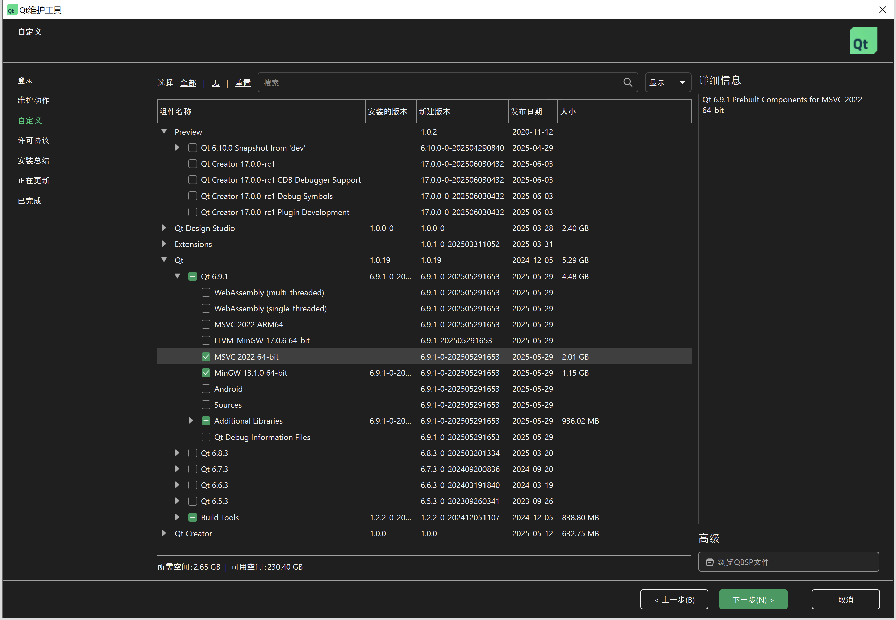
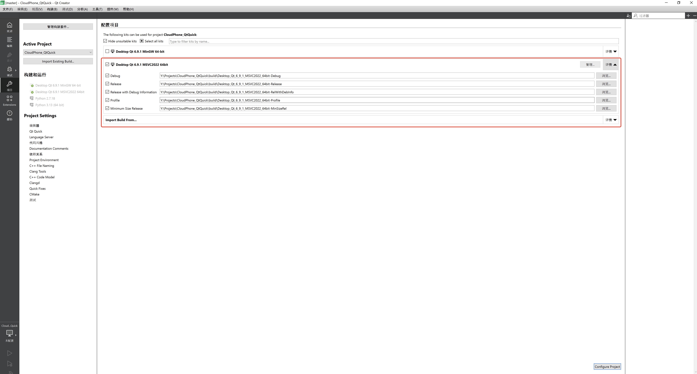

# CloudStream_QtQuick_Demo

基于 Qt Quick 的云手机TcrSdk客户端演示工程

## 项目简介

CloudStream_QtQuick_Demo 是一个基于 Qt 6/QML 的云手机串流客户端演示工程，集成了 [TcrSdk](https://cg-sdk-1258344699.cos.ap-nanjing.myqcloud.com/CloudDeviceWinSDK/docs/release_note.html) 云手机 SDK，支持多视频流渲染、触摸/按键控制等功能。适用于 Windows 平台，便于企业或开发者参考如何使用TcrSdk以及与业务后台进行交互。

## 主要功能

- **实例展示**：卡片展示云手机实例画面，支持实时预览
- **视频串流**：支持单实例和多实例同步视频流渲染与交互
- **多渲染路径**：
  - YUV软件渲染：基于 OpenGL Shader 的 I420 格式视频渲染
  - D3D11硬件渲染：支持 D3D11 GPU 纹理直接渲染RGBA纹理
- **多会话管理**：演示如何使用 TcrSdk 创建多个会话，实现多实例同时串流

## 目录结构

```
.
├── CMakeLists.txt                # CMake 构建脚本
├── docs/                         # 文档图片
│   └── images/
├── qml/                          # QML 界面文件
│   ├── InstanceTokenWindow.qml   # 启动页，演示如何通过实例ID获取AccessToken
│   ├── MainWindow.qml            # 主界面（云手机实例画面展示）
│   ├── StreamingWindow.qml       # 串流窗口(演示如何连接到云机实例并进行交互)
│   └── components/               # QML 复用组件
│       └── Dialogs.qml           # 对话框
├── README.md                     # 本文档
├── shaders/                      # OpenGL 着色器
│   ├── yuv.frag                  # YUV片段着色器（I420格式）
│   ├── yuv.vert                  # YUV顶点着色器
│   ├── d3d11_texture.frag        # D3D11纹理片段着色器（RGBA格式）
│   └── d3d11_texture.vert        # D3D11纹理顶点着色器
├── src/                          # C++ 源码
│   ├── main.cpp                  # 程序入口
│   ├── core/                     # 业务核心与渲染
│   │   └── video/                # 视频渲染相关
│   │       ├── Frame.h           # 视频帧数据结构（支持I420_CPU和D3D11_GPU）
│   │       ├── VideoRenderItem.h # QQuickItem视频渲染组件
│   │       ├── VideoRenderItem.cpp
│   │       ├── YuvMaterial.h     # OpenGL YUV着色材质（I420格式）
│   │       ├── YuvMaterial.cpp
│   │       ├── YuvNode.h         # 场景图YUV渲染节点
│   │       ├── YuvNode.cpp
│   │       ├── D3D11Material.h   # D3D11纹理材质（支持NV12转RGBA）
│   │       ├── D3D11Material.cpp
│   │       ├── D3D11Node.h       # 场景图D3D11渲染节点
│   │       ├── D3D11Node.cpp
│   │       ├── YuvTestPattern.h  # YUV测试模式工具
│   │       └── YuvTestPattern.cpp
│   ├── services/                 # 网络与API服务
│   │   ├── ApiService.h          # 云手机API服务接口
│   │   ├── ApiService.cpp        
│   │   └── NetworkService.h      # 网络请求服务接口
│   │   ├── NetworkService.cpp
│   ├── utils/                    # 工具类
│   │   ├── Logger.h              # 日志工具
│   │   ├── Logger.cpp
│   │   ├── VariantListConverter.h # 数据类型转换工具
│   │   ├── VariantListConverter.cpp
│   │   └── EnvInfoPrinter.h      # 环境信息打印工具
│   └── viewmodels/               # QML 绑定的 ViewModel
│       ├── InstanceTokenViewModel.h   # 演示如何请求业务后台接口拿到AccessToken
│       ├── InstanceTokenViewModel.cpp
│       ├── StreamingViewModel.h   # 单实例串流交互控制管理
│       ├── StreamingViewModel.cpp
│       ├── MultiStreamViewModel.h # 多实例串流管理（演示多会话）
│       └── MultiStreamViewModel.cpp
└── third_party/
    └── TcrSdk/                   # 云手机SDK（含头文件、lib、dll）
        ├── Debug/                # Debug版本SDK
        │   ├── include/
        │   ├── Win32/
        │   └── x64/
        └── Release/              # Release版本SDK
            ├── include/
            ├── Win32/
            └── x64/

```

## 依赖环境

- **编译器** 需使用`MSVC 2022 64-bit`进行编译
- **Qt 6.8+** (需包含 Quick、Network、Concurrent、ShaderTools 模块)
- **CMake 3.16+**
- **TcrSdk** 云手机 SDK（请从[TcrSdk发布记录](https://github.com/tencentyun/cloudgame-windows-sdk/blob/main/Docs/Release_Note.md)下载并拷贝到`third_party/TcrSdk` 目录）

## 构建方法

### 1. 安装 Visual Studio（MSVC 编译器）

- 如果尚未安装，请前往 [Visual Studio 2022 官方下载页面](https://visualstudio.microsoft.com/zh-hans/downloads/)下载安装包。
- 安装过程中**务必勾选“使用C++的桌面开发”**，以确保 MSVC 编译器和相关工具链被正确安装。

---

### 2. 安装 Qt 6 的 MSVC 版本

- 启动 **Qt Maintenance Tool** 或 **Qt Online Installer**。
- 选择“添加或删除组件”。
- 在“Qt 6.x.x”下，找到与你的 Visual Studio 版本对应的 MSVC 组件，例如：
  - `MSVC 2022 64-bit`
- 勾选所需的 MSVC 版本，点击“下一步”完成安装。
- 

---

### 3. 在 Qt Creator 里选择 MSVC Kit

- 安装完成后，重启 **Qt Creator**。
- 打开“工具”→“选项”→“Kits”（或“构建套件”）。
- 在“自动检测”区域应能看到类似 `Desktop Qt 6.x.x MSVC 2022 64-bit` 的 Kit。
- 新建项目或打开本项目时，选择对应的 MSVC Kit 进行构建。
- 

---

### 4. 使用 Qt Creator 打开并编译项目

1. 启动 **Qt Creator**，点击“打开项目”，选择本项目根目录下的 `CMakeLists.txt` 文件。
2. 在弹出的“配置项目”界面，选择你已安装的 MSVC Kit（如 `Desktop Qt 6.x.x MSVC 2022 64-bit`）。
3. 点击“配置项目”并等待 Qt Creator 完成 CMake 配置。
4. 在左侧“项目”面板中，点击“构建”按钮（或按 `Ctrl+B`）进行编译。
5. 编译完成后，可直接点击“运行”按钮（或按 `Ctrl+R`）启动程序。

> **注意：**  
> - 运行前请确保构建的套件是`MSVC 2022 64-bit`

---

## 常见问题

- **Q: 运行过程中出现其他错误, 如连接云手机失败？**  
  A: 请在logs目录下找到`app.log`文件, 并将文件反馈给云渲染开发团队。