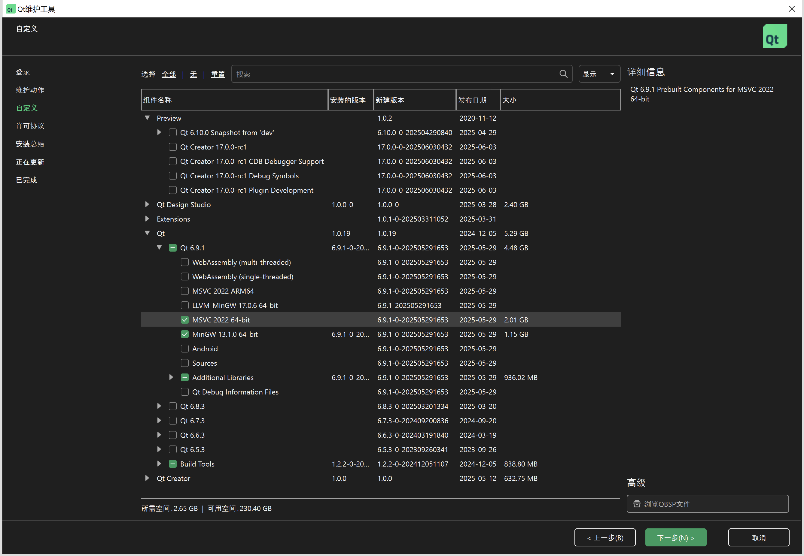
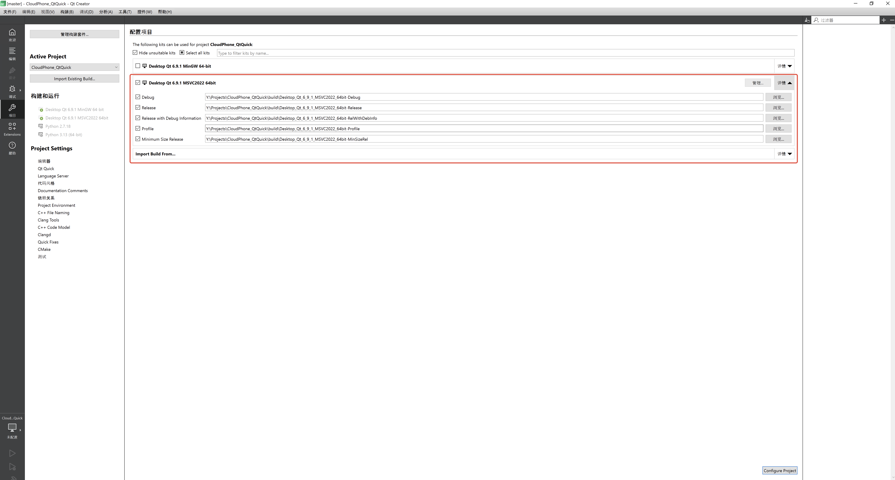

# CloudStream_QtQuick_Demo

基于 Qt Quick 的 TcrSdk 串流能力 客户端演示工程（云手机 + 云桌面）

## 项目简介

CloudStream_QtQuick_Demo 是一个基于 Qt 6/QML 的 TcrSdk 客户端演示工程，集成了 TcrSdk SDK，演示**云手机**和**云桌面**两种业务场景下的串流功能。支持 **Windows**、**macOS** 和 **Linux** 平台，便于企业或开发者参考如何使用 TcrSdk 以及与业务后台进行交互。

> **注意**：云手机和云桌面的串流/音视频/数据通道底层使用**同一份 TcrSdk**，核心差异在控制输入路径：
> - **云手机**（Android）：通过 SDK 内置的触摸/按键接口（`tcr_session_touchscreen_touch` 等）控制云端实例
> - **云桌面**（Windows）：SDK 内置接口不适用，客户端自行捕获键鼠事件后通过自定义数据通道（`tcr_data_channel_send`）发送 JSON 格式输入消息
> 
> 详见协议示例 [docs/desktop_input_protocol.md](docs/desktop_input_protocol.md)。

## 主要功能

- **云手机支持**：卡片展示云手机实例画面，支持单实例和多实例同步视频流渲染与交互
- **云桌面支持**：单画面 16:9 横屏渲染，通过自定义数据通道发送键鼠事件操作云端 Windows 桌面
- **自定义渲染**：基于 OpenGL Shader 的 YUV 视频渲染
- **麦克风/摄像头**：支持本地麦克风和摄像头设备的枚举与切换（云手机场景）
- **性能统计**：实时显示串流性能数据（FPS、延迟、码率等）
- **跨平台支持**：Windows（MSVC）、macOS（Apple Silicon / Intel）与 Linux（x86_64）

## 目录结构

```
.
├── CMakeLists.txt                    # CMake 构建脚本（支持 Windows/macOS/Linux）
├── cmake/                            # 平台特定 CMake 配置
│   ├── TcrSdkWindows.cmake           # Windows SDK 链接配置
│   ├── TcrSdkMacOS.cmake             # macOS SDK 链接配置
│   └── TcrSdkLinux.cmake             # Linux SDK 链接配置
├── Info.plist.in                     # macOS 隐私权限声明模板（摄像头/麦克风）
├── config.json                       # 业务配置文件（baseUrl、instanceIds 等）
├── docs/                             # 文档
│   ├── desktop_input_protocol.md     # 云桌面输入数据通道 JSON 协议
│   └── images/
├── qml/                              # QML 界面文件
│   ├── InstanceTokenWindow.qml       # 启动页，演示如何获取 AccessToken + 选择业务场景
│   ├── MainWindow.qml                # 云手机主界面（多实例卡片 GridView）
│   ├── StreamingWindow.qml           # 云手机串流大窗口（触摸/按键控制）
│   ├── DesktopWindow.qml             # 云桌面串流窗口（键鼠捕获 + 自定义数据通道）
│   └── components/                   # QML 复用组件
│       ├── CameraDeviceDialog.qml    # 摄像头设备选择对话框（云手机场景）
│       ├── ControlButtonArea.qml     # 云手机控制按钮区域（Home/音量/摄像头等）
│       ├── Dialogs.qml               # 通用对话框
│       ├── MicrophoneDeviceDialog.qml# 麦克风设备选择对话框（云手机场景）
│       ├── StatsOverlay.qml          # 性能统计浮层
│       ├── StreamSettingsDialog.qml  # 串流参数设置对话框
│       └── VideoRenderArea.qml       # 视频渲染区域组件（云手机场景，含触摸 MouseArea）
├── README.md                         # 本文档
├── shaders/                          # OpenGL 着色器
│   ├── yuv.frag                      # YUV 片段着色器
│   └── yuv.vert                      # YUV 顶点着色器
├── src/                              # C++ 源码
│   ├── main.cpp                      # 程序入口
│   ├── core/                         # 业务核心
│   │   ├── AppConfig.h/cpp           # 应用配置（读取 config.json）
│   │   ├── StreamConfig.h/cpp        # 串流参数配置
│   │   ├── input/                    # 键鼠捕获（云桌面场景）
│   │   │   └── InputCaptureItem.h/cpp# 通用键鼠捕获 QQuickItem
│   │   └── video/                    # 视频渲染相关
│   │       ├── Frame.h/cpp           # 视频帧数据结构
│   │       ├── VideoRenderItem.h/cpp # QQuickItem 视频渲染组件（SceneGraph）
│   │       ├── VideoRenderPaintedItem.h/cpp # QPainter 软件渲染备选
│   │       ├── VideoTransformHelper.h/cpp   # 视频变换辅助
│   │       ├── YuvDynamicTexture.h/cpp      # YUV 动态纹理更新
│   │       ├── YuvMaterial.h/cpp     # OpenGL YUV 着色材质
│   │       ├── YuvNode.h/cpp         # 场景图 YUV 渲染节点
│   │       └── YuvTestPattern.h/cpp  # YUV 测试图案生成工具
│   ├── services/                     # 网络与 API 服务
│   │   ├── ApiService.h/cpp          # 云手机 API 服务（AccessToken 获取等）
│   │   └── NetworkService.h/cpp      # 网络请求封装
│   ├── utils/                        # 工具类
│   │   ├── CrashDumpHandler.h/cpp    # 崩溃转储处理（仅 Windows）
│   │   ├── EnvInfoPrinter.h          # 环境信息打印
│   │   ├── Logger.h/cpp              # 日志工具
│   │   ├── VariantListConverter.h/cpp# QVariant 列表转换工具
│   │   └── YuvFrameDumper.h/cpp      # YUV 帧导出调试工具
│   └── viewmodels/                   # QML 绑定的 ViewModel
│       ├── InstanceTokenViewModel.h/cpp  # 获取 AccessToken，驱动启动页
│       ├── MultiStreamViewModel.h/cpp    # 云手机多实例串流管理
│       ├── StreamingViewModel.h/cpp      # 云手机单实例串流交互控制
│       └── DesktopViewModel.h/cpp        # 云桌面会话管理（自定义数据通道输入）
└── third_party/
    └── TcrSdk/                       # 云手机 SDK（含头文件及各平台库）
        ├── include/                  # 公共头文件（跨平台）
        │   ├── tcr_c_api.h
        │   ├── tcr_types.h
        │   └── tcr_export.h
        ├── win/                      # Windows 平台
        │   ├── Release/
        │   │   ├── x64/              # TcrSdk.dll / TcrSdk.lib / TcrSdk.pdb
        │   │   └── Win32/
        │   └── Debug/
        │       ├── x64/
        │       └── Win32/
        ├── macos/                    # macOS 平台（Universal Binary）
        │   └── lib/
        │       └── libTcrSdk.dylib
        └── linux/                    # Linux 平台（x86_64）
            └── lib/
                └── libTcrSdk.so
```

## 依赖环境

### Windows

- **编译器**：`MSVC 2022 64-bit`
- **Qt 6.8+**（需包含 Quick、Network、Concurrent、ShaderTools 模块）
- **CMake 3.16+**
- **TcrSdk**：请从[TcrSdk发布记录](https://github.com/tencentyun/cloudgame-windows-sdk/blob/main/Docs/Release_Note.md)下载 Windows SDK，解压后将 `win/` 目录和 `include/` 目录拷贝到 `third_party/TcrSdk/` 下

### macOS

- **Xcode 14.0+**（需安装 Command Line Tools）
- **Qt 6.8+**（需包含 macOS Kit，支持 Apple Silicon 或 Intel）
- **CMake 3.16+**
- **TcrSdk**：请从[TcrSdk发布记录](https://github.com/tencentyun/cloudgame-windows-sdk/blob/main/Docs/Release_Note.md)下载 macOS Universal SDK，解压后将 `macos/` 目录和 `include/` 目录拷贝到 `third_party/TcrSdk/` 下

### Linux

- **glibc 2.28+**，x86_64 架构
- **Qt 6.8+**（需包含 Quick、Network、Concurrent、ShaderTools 模块）
- **CMake 3.16+**
- **TcrSdk**：请从[TcrSdk发布记录](https://github.com/tencentyun/cloudgame-windows-sdk/blob/main/Docs/Release_Note.md)下载 Linux SDK，解压后将 `linux/` 目录和 `include/` 目录拷贝到 `third_party/TcrSdk/` 下

## 构建方法

### Windows

#### 1. 安装 Visual Studio（MSVC 编译器）

- 如果尚未安装，请前往 [Visual Studio 2022 官方下载页面](https://visualstudio.microsoft.com/zh-hans/downloads/)下载安装包。
- 安装过程中**务必勾选"使用C++的桌面开发"**，以确保 MSVC 编译器和相关工具链被正确安装。

---

#### 2. 安装 Qt 6 的 MSVC 版本

- 启动 **Qt Maintenance Tool** 或 **Qt Online Installer**。
- 选择"添加或删除组件"。
- 在"Qt 6.x.x"下，找到与你的 Visual Studio 版本对应的 MSVC 组件，例如：
  - `MSVC 2022 64-bit`
- 勾选所需的 MSVC 版本，点击"下一步"完成安装。
- 

---

#### 3. 在 Qt Creator 里选择 MSVC Kit

- 安装完成后，重启 **Qt Creator**。
- 打开"工具"→"选项"→"Kits"（或"构建套件"）。
- 在"自动检测"区域应能看到类似 `Desktop Qt 6.x.x MSVC 2022 64-bit` 的 Kit。
- 新建项目或打开本项目时，选择对应的 MSVC Kit 进行构建。
- 

---

#### 4. 使用 Qt Creator 打开并编译项目

1. 启动 **Qt Creator**，点击"打开项目"，选择本项目根目录下的 `CMakeLists.txt` 文件。
2. 在弹出的"配置项目"界面，选择已安装的 MSVC Kit（如 `Desktop Qt 6.x.x MSVC 2022 64-bit`）。
3. 点击"配置项目"并等待 Qt Creator 完成 CMake 配置。
4. 在左侧"项目"面板中，点击"构建"按钮（或按 `Ctrl+B`）进行编译。
5. 编译完成后，可直接点击"运行"按钮（或按 `Ctrl+R`）启动程序。

> **注意：** 运行前请确保构建的套件是 `MSVC 2022 64-bit`

---

### macOS

#### 1. 安装 Xcode 及 Command Line Tools

```bash
xcode-select --install
```

或从 Mac App Store 下载安装完整的 Xcode（14.0+）。

---

#### 2. 安装 Qt 6 的 macOS Kit

- 启动 **Qt Maintenance Tool** 或 **Qt Online Installer**。
- 在"Qt 6.x.x"下，找到 macOS 组件：
  - `macOS` (支持 Apple Silicon / Intel Universal Binary)
- 勾选并完成安装。

---

#### 3. 在 Qt Creator 里选择 macOS Kit

- 重启 **Qt Creator**。
- 打开"工具"→"选项"→"Kits"。
- 在"自动检测"区域应能看到类似 `Desktop Qt 6.x.x for macOS` 的 Kit。
- 打开本项目时选择该 Kit。

---

#### 4. 使用 Qt Creator 打开并编译项目

1. 启动 **Qt Creator**，点击"打开项目"，选择 `CMakeLists.txt`。
2. 在"配置项目"界面选择 macOS Kit。
3. 点击"配置项目"等待 CMake 配置完成。
4. 点击"构建"（`Cmd+B`）进行编译。
5. 编译完成后点击"运行"（`Cmd+R`）启动程序。

> **注意：**
> - 首次运行时，macOS 可能弹出摄像头/麦克风权限授权对话框，请点击"允许"。
> - 如遇到 `libTcrSdk.dylib` 无法加载，请确认 `third_party/TcrSdk/macos/lib/` 目录下存在该文件。

---

## 常见问题

- **Q: 运行时提示找不到 `TcrSdk.dll` / `libTcrSdk.dylib` / `libTcrSdk.so`？**
  A: 请确认 SDK 文件已正确拷贝到 `third_party/TcrSdk/` 对应平台子目录下，并重新编译。

- **Q: macOS 访问摄像头/麦克风时提示权限被拒绝？**
  A: 请在"系统设置"→"隐私与安全性"中，找到对应权限（摄像头/麦克风），确认已允许该应用访问。或检查 `Info.plist.in` 中是否已包含 `NSCameraUsageDescription` / `NSMicrophoneUsageDescription` 字段并重新编译。

- **Q: macOS 构建报错 `TcrSdk dynamic library not found`？**
  A: 请确认 `third_party/TcrSdk/macos/lib/` 目录下存在 `libTcrSdk.dylib` 文件。

- **Q: 运行过程中出现其他错误，如连接云手机失败？**
  A: 请在 logs 目录下找到 `app.log` 文件，并将文件反馈给云渲染开发团队。
