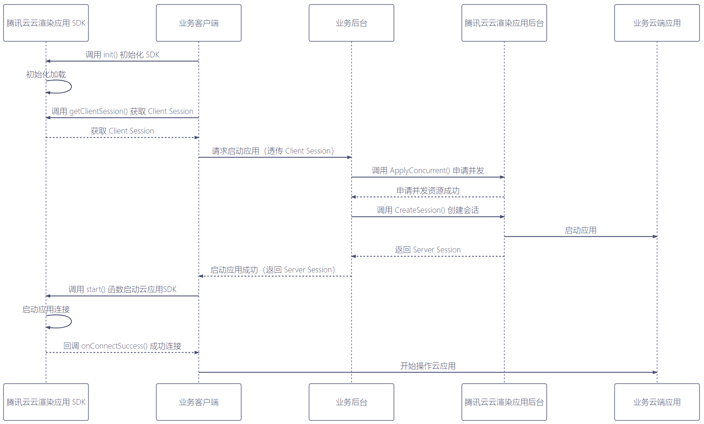

# 腾讯云渲染Windows
云渲染是指在云端渲染3D应用，利用串流技术将画面实时推送到终端显示，并且让用户可以通过终端与云端应用进行实时的交互操作。
它可以解决终端算力不足，用户需提前安装配置复杂的软件，终端一次性采购成本高的问题。

腾讯云渲染是前后端一体的PaaS平台产品，提供了各平台客户端SDK和后端API。您需要搭建自己的业务客户端程序和业务后台程序，才能运行看到云渲染的效果。

云渲染下有两类业务场景，分别为[云游戏](https://cloud.tencent.com/document/product/1162)和[应用云渲染](https://cloud.tencent.com/document/product/1547)。

腾讯云云游戏依托腾讯丰富的边缘计算节点、灵活的GPU虚拟化技术、稳定低延时的音视频互动能力，为游戏开发者提供一站式的云游戏 PaaS 解决方案。开发者无需适配不同的软硬件平台，即可快速部署上线，让玩家在各类终端和场景下，无需安装即可获得3A级的游戏体验。

应用云渲染依托腾讯丰富的边缘计算节点、灵活的GPU虚拟化技术、稳定低延时的音视频串流能力，帮助您将应用客户端云化，使得用户无需下载应用包体，仅需打开视频画面即可操作体验云上应用。同时，应用云渲染提供云API+全端SDK，满足您的用户在各类终端以及业务场景下的需要。
  

  
创建业务后台程序可以参考这个[应用云渲染业务后台Demo](https://github.com/tencentyun/car-server-demo)([云游戏业务后台Demo](https://github.com/tencentyun/gs-server-demo))，创建客户端程序可以参考下面的[TcrDemo](https://github.com/tencentyun/cloudgame-windows-sdk/tree/main/TcrDemo)。在此之前您还需要先[申请](https://cloud.tencent.com/document/product/1162/46135)腾讯云渲染服务。

腾讯云渲染Windows SDK管理了终端和云端的会话连接，数据通道、音视频轨道，可以上下行文本和音视频数据；提供和云端虚拟设备、应用交互的上层接口；进行串流画面的本地渲染，缩放旋转操作，本地触屏事件到云端操作的映射，视图-视频-云端坐标系的转换。让您可以快速开发出业务客户端程序。

本仓库目录存放了腾讯云渲染Windows SDK的相关资料。

## Demo
查看[TcrDemo](https://github.com/tencentyun/cloudgame-windows-sdk/tree/main/TcrDemo)，Windows SDK组件在TcrDemo/tcrsdk目录下。

## 文档
[接入教程文档](https://github.com/tencentyun/cloudgame-windows-sdk/blob/main/docs/SDK%E9%9B%86%E6%88%90%E6%8C%87%E5%8D%97.md)以及[SDK API文档](https://tencentyun.github.io/cloudgame-windows-sdk/tcrsdk/index.html)
